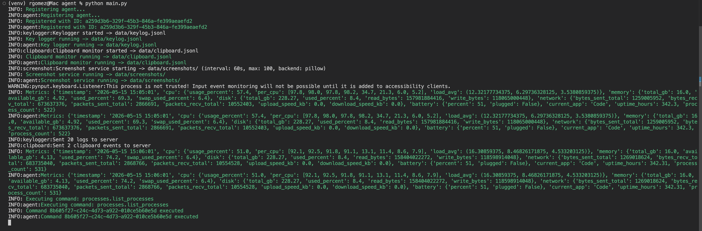

# Agent

The agent is the desktop-side process for Agent Activity. Its job is to introduce the machine to the backend, keep reporting that it is alive, send system metrics, and execute the small command set supported by the platform. On Windows and macOS it can also run background services for keyboard activity, clipboard changes, and screenshots.



> [!CAUTION]
> The agent can collect sensitive user activity. Run it only where monitoring is authorized, disclosed, and expected.

## Running From Source

Start the backend first, then install the agent dependencies:

```sh
python -m venv venv
source venv/bin/activate
pip install --upgrade pip
pip install -r requirements.txt
python main.py
```

On Windows:

```bat
python -m venv venv
venv\Scripts\activate
pip install --upgrade pip
pip install -r requirements.txt
python main.py
```

On some Linux systems you may need the venv package before creating the environment:

```sh
sudo apt install python3-venv binutils -y
```

## Configuration

The main settings live in `config/settings.py`. The most important value is `SERVER_URL`, which defaults to `http://localhost:8000`. Point it at the backend before running the agent on a different machine.

`METRICS_INTERVAL` controls how often the agent sends heartbeat metrics and checks for commands. `APP_NAME` controls the package, service, app, and tray names. The keylog, clipboard, and screenshot intervals control how frequently local buffers are flushed and uploaded. `MAX_FILE_SIZE` limits the `filesystem.read_file` command.

## What Happens On Startup

When the agent starts, it looks for a saved identity in `data/agent_id.txt`. If one exists, it reuses it. If not, it gathers basic host information and registers with the backend. After registration, the main loop sends metrics and polls the command endpoint on every interval.

On Windows and macOS, the loop also starts the capture services once. Linux currently uses the shared loop for metrics and command polling; packaged Linux runs as a daemon through `systemd`.

## Supported Commands

The backend can queue commands for an online agent. The agent fetches pending commands, executes the matching handler, and reports either `executed` with a JSON result or `failed` with an error.

- `filesystem.list_directory` lists one directory level.
- `filesystem.read_file` reads text files up to `MAX_FILE_SIZE`.
- `processes.list_processes` returns running process information from `psutil`.

## Local Data

Source runs write identity, buffered activity, screenshots, and logs under the local `agent/` folder. Packaged builds redirect those files to the normal application data location for each operating system, described in the platform packaging guides.

## Packaging

Use the platform package scripts when you want the agent to behave like a normal installed desktop app or service:

- [Linux package](pkgs/linux/README.md)
- [macOS package](pkgs/mac/README.md)
- [Windows package](pkgs/windows/README.md)

Shared PyInstaller options are kept in `pkgs/pyinstaller_config.py`.
