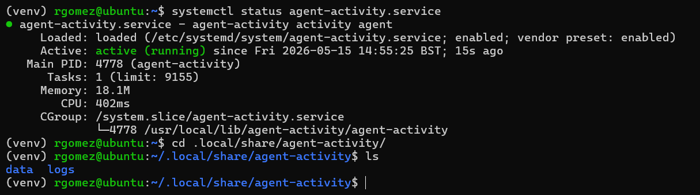

# Linux Package

The Linux package turns the agent into a background `systemd` service. This is the right path when you want the agent to start on boot, run without a visible UI, and be managed with normal service commands.



## Build And Install

Activate the agent virtual environment first, then run:

```sh
cd agent/pkgs/linux
chmod +x build_linux.sh uninstall_linux.sh
./build_linux.sh
```

The script builds the agent with PyInstaller, installs the executable under `/usr/local/bin`, creates a service file, reloads `systemd`, enables the service, and starts it. Root privileges are required for the install locations, so the script uses `sudo` when needed.

## Runtime Behavior

The service runs as the user that launched the installer through `sudo`, or as the current user when run directly as root. Bundled runtime files are written under:

```text
~/.local/share/agent-activity
```

Service output is appended to:

```text
~/.local/share/agent-activity/logs/service.log
```

The daemon entry point also uses a lock file at `/tmp/agent-activity.lock` so a second copy exits instead of running beside the first one.

## Managing The Service

```sh
systemctl status agent-activity
systemctl start agent-activity
systemctl stop agent-activity
systemctl restart agent-activity
systemctl disable agent-activity
```

## Uninstall

Activate the same Python environment, then run:

```sh
cd agent/pkgs/linux
./uninstall_linux.sh
```

The uninstall script stops and disables the service, removes the installed binary and optional app directory, deletes the lock file, and removes the user's app data directory.

## Notes

The current Linux packaged agent is best suited for metrics and command polling. The shared agent loop only starts keylog, clipboard, and screenshot services automatically on Windows and macOS.
