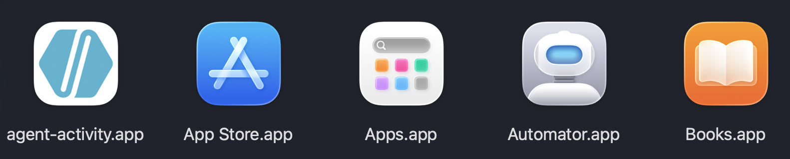
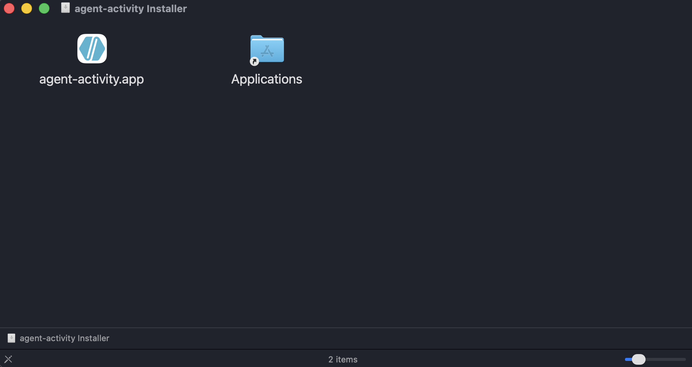
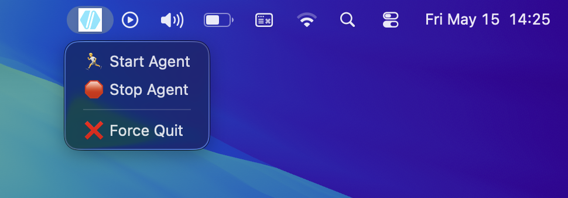
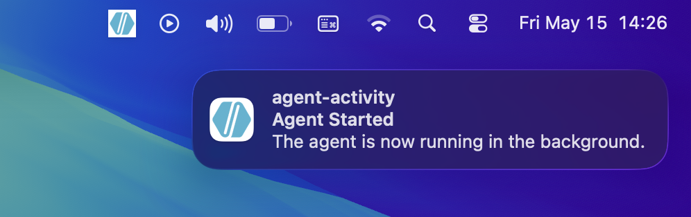

# macOS Package

The macOS package turns the agent into a menu bar app. It gives the user simple Start, Stop, and Force Quit controls while the actual agent loop runs in the background.



## Build

Activate the agent virtual environment on macOS, then run:

```sh
cd agent/pkgs/mac
chmod +x build_mac.sh uninstall_mac.sh
./build_mac.sh
```

The script builds an `.app` bundle with PyInstaller and then creates a DMG with an Applications shortcut. The generated artifacts are written under `agent/dist/mac`.



## Runtime Behavior

When bundled, the app stores identity, logs, buffered activity, and screenshots under:

```text
~/Library/Application Support/agent-activity
```

The menu bar app prevents duplicate app instances, starts the agent loop on request, and uses notifications to report basic state changes.



## Permissions

macOS may ask for privacy permissions depending on which capture services are used. Keyboard capture can require Accessibility or Input Monitoring permission. Screenshots can require Screen Recording permission. Active application detection may trigger Automation-related prompts because it uses AppleScript.

These permissions are granted by the user in macOS System Settings. Without them, the app may still run, but some capture features can return empty or partial data.



## Uninstall

Activate the agent virtual environment, then run:

```sh
cd agent/pkgs/mac
./uninstall_mac.sh
```

The uninstall script stops running app processes, removes `/Applications/agent-activity.app` when present, and deletes:

```text
~/Library/Application Support/agent-activity
```
