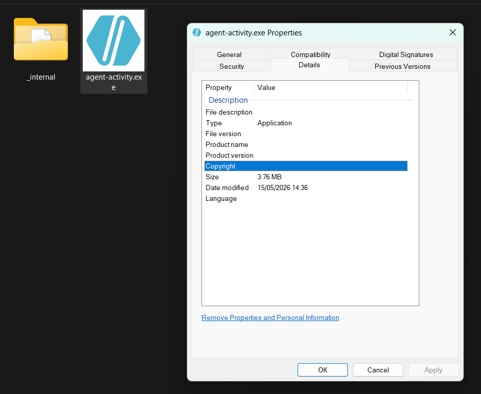
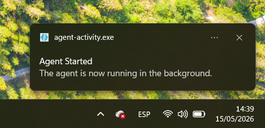
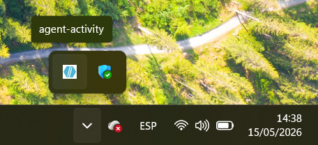

# Windows Package

This folder contains the Windows PyInstaller entry point and package scripts for the agent. The packaged Windows agent runs as a system tray app.



## Files

- `main_windows.py`: tray app entry point using `pystray`.
- `build_windows.spec`: PyInstaller spec for Windows.
- `runtime_windows_paths.py`: redirects bundled app data to `%APPDATA%`.
- `build_windows.bat`: builds the Windows artifact.
- `uninstall_windows.bat`: kills the app process and removes generated artifacts and app data.

## Build

Run from Command Prompt or PowerShell on Windows:

```bat
cd agent\pkgs\windows
build_windows.bat
```

> [!IMPORTANT]
> Ensure the Python virtual environment is **active** before running `build_windows.bat`.



## Runtime Paths

When bundled by PyInstaller, `runtime_windows_paths.py` changes the process working directory to:

```text
%APPDATA%\agent-activity
```

Runtime data is stored below that directory:

- `data\`
- `logs\`
- `data\agent_id.txt`
- `data\keylog.jsonl`
- `data\clipboard.jsonl`
- `data\screenshots\`

## Tray Behavior

The tray menu exposes:

- `Start Agent`: starts the agent loop in a background thread.
- `Stop Agent`: signals the loop to stop and stops keylogger, clipboard, and screenshot services.
- `Quit Agent`: stops services and exits the tray app.

The entry point enforces one running instance with a named Windows mutex:

```text
Local\agent-activity-single-instance
```



## Uninstall

```bat
cd agent\pkgs\windows
uninstall_windows.bat
```

The uninstall script:

- Kills `agent-activity.exe` if it is running.
- Removes `agent\build\windows`.
- Removes `agent\dist\windows`.
- Removes `%APPDATA%\agent-activity`.

> [!IMPORTANT]
> Ensure the Python virtual environment is **active** before running `uninstall_windows.bat`.
