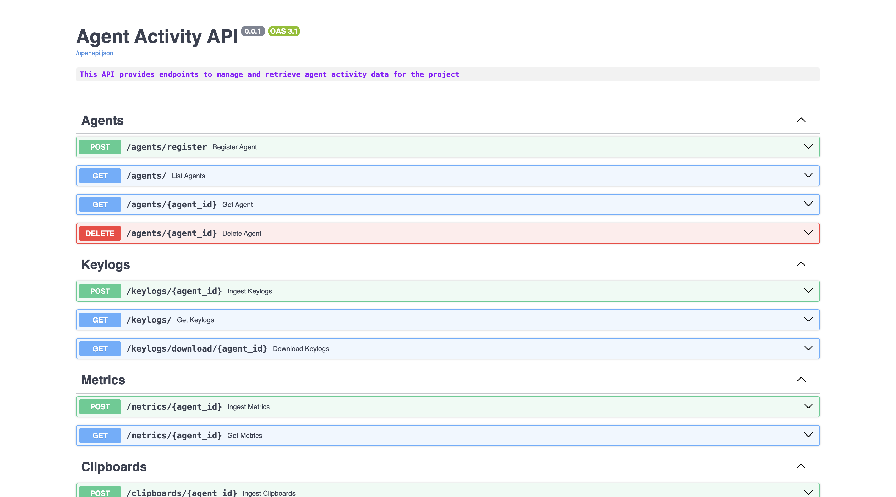

# Backend

The backend is the API and persistence layer for Agent Activity. Agents report to it, the dashboard reads from it, and scheduled jobs keep agent status and stored screenshots from going stale. It is intentionally compact: FastAPI for the HTTP layer, SQLAlchemy and Alembic for persistence, SQLite for local storage, and APScheduler for background maintenance.



## Running It Locally

Install dependencies, apply migrations, and start the API:

```sh
python -m venv venv
source venv/bin/activate
pip install --upgrade pip
pip install -r requirements.txt
alembic upgrade head
python -m app.main
```

On Windows:

```bat
python -m venv venv
venv\Scripts\activate
pip install --upgrade pip
pip install -r requirements.txt
alembic upgrade head
python -m app.main
```

The API runs at `http://127.0.0.1:8000`. Swagger UI is available at `http://localhost:8000/docs`.

## Database And Migrations

The local database is SQLite and is created as `database.db` after migrations are applied. Alembic migration files live under `alembic/versions`.

Useful commands:

```sh
alembic upgrade head
alembic revision --autogenerate -m "describe change"
alembic downgrade -1
```
