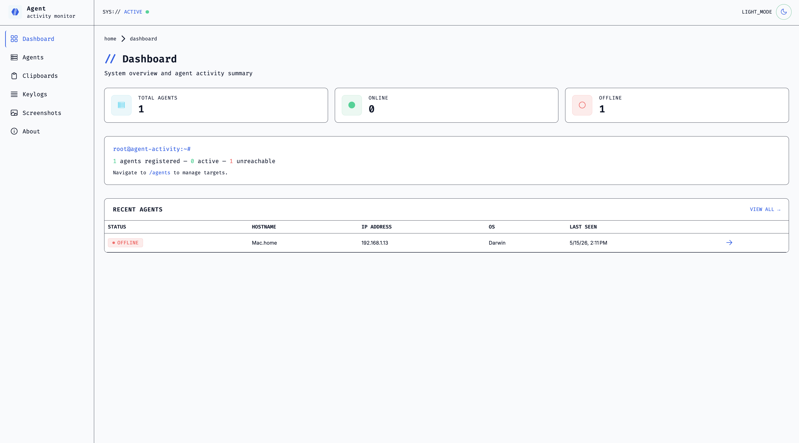

# Frontend

The frontend is an Angular dashboard for the Agent Activity API. It shows registered agents, online/offline status, system metrics, screenshots, clipboard events, keylogs, and command history.



## Stack

- Angular.
- TypeScript.
- PrimeNG and PrimeIcons.
- Chart.js for metrics charts.
- Tailwind CSS.
- RxJS and Angular `HttpClient`.

## Setup

Run all commands from `frontend/`.

```sh
npm install
ng serve
```

The development server runs at `http://localhost:4200`.
